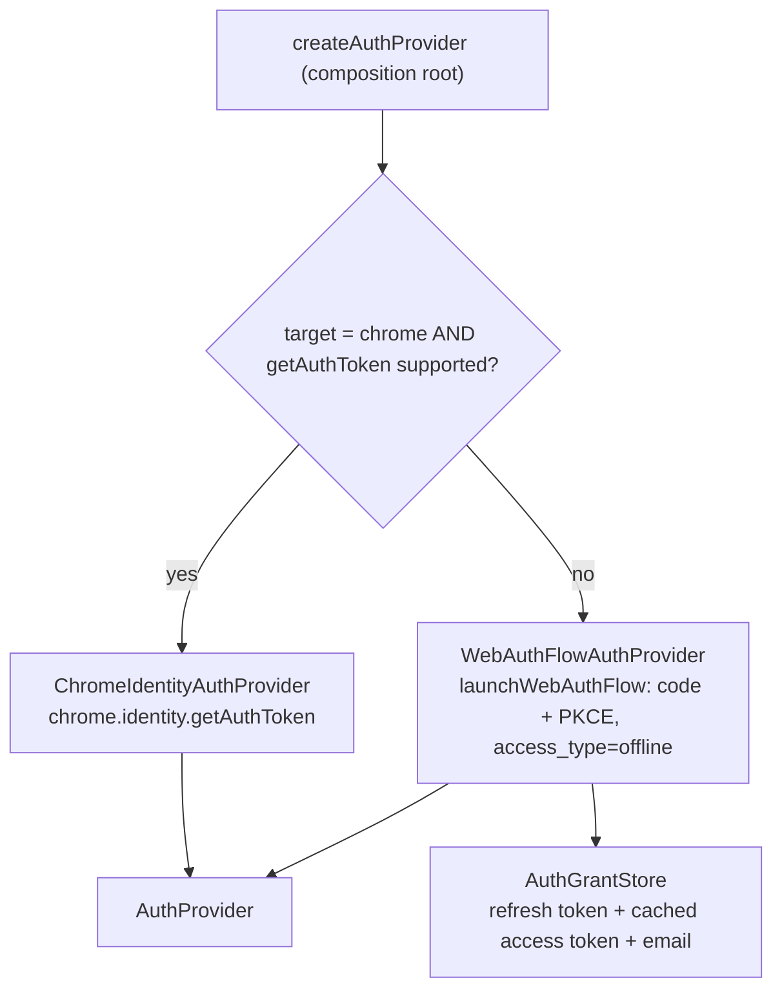

# Platform / Capabilities — the auth seam (the Google grant)

> The Google account *grant* behind a single port (`AuthProvider`): acquiring tokens, reporting what is connected, and handing the connection back. Chrome signs in natively through `chrome.identity.getAuthToken` (zero configuration, no account choice); every other supported browser uses the standard OAuth2 + PKCE redirect flow (ADR-0002). For symbol-level structure use codegraph (`codegraph_explore "AuthProvider createAuthProvider"`).

> **Archetype:** *External Integration* (seam). Small but pivotal — it's the file you change to support a new browser. Token *use* (caching, refresh-on-401) is [`offscreen/drive`](../../offscreen/drive/README.md); the silent→interactive *policy* and the settings-page commands are `background/driveAuth.ts`; this folder owns the grant itself.

## Purpose & mental model

Hold the user's Google grant and mint access tokens from it, hiding *how* behind a port. The mental model: **connect once, spend silently** — an interactive authorization leaves behind something that mints tokens without UI (Chrome's own grant, or a stored refresh token), so every upload and every settings-page load is silent. That is what lets the settings page show a real connection and lets uploads run without a prompt after a call.

## The port

```ts
interface AuthProvider {
  getToken(request: { interactive: boolean }): Promise<string>; // cached -> silent -> (interactive)
  connect(): Promise<AuthConnection>;                           // interactive; on WebAuthFlow, how you switch account
  getConnection(): Promise<AuthConnection>;                     // { connected, email, canChooseAccount }
  disconnect(): Promise<void>;                                  // revoke at Google, then forget
  invalidateToken(token: string): Promise<void>;                // drop the cached token, keep the grant
}
```

## Strategy selection



- **`ChromeIdentityAuthProvider`** — `chrome.identity.getAuthToken`. The grant lives in Chrome, tied to the browser profile's Google account: no client secret, no redirect URI, no build configuration beyond the public client id in `manifest.oauth2`, and no window at sign-in. `canChooseAccount` is **false** — the account is the profile's. Disconnect revokes at Google *and* clears Chrome's token cache; either alone would leave the other side still working.
- **`WebAuthFlowAuthProvider`** — `launchWebAuthFlow` with `response_type=code` + PKCE, `access_type=offline` and `prompt=select_account consent`, exchanged for a token set at Google's token endpoint. `canChooseAccount` is **true**. The grant (refresh token, cached access token and expiry, the account email read from the `id_token`) is persisted through `AuthGrantStore` in `chrome.storage.local`, so it outlives the service worker.
- **Selection** is by **build target + runtime capability**: `target === 'chrome' && chrome.identity.getAuthToken` exists → ChromeIdentity; otherwise WebAuthFlow. Edge, Brave, Opera, Vivaldi and Arc always select WebAuthFlow even if their Chromium runtime happens to expose a `getAuthToken`. The runtime guard means a misconfigured Chrome build falls back rather than crashing.

## Key invariants & gotchas

- **This folder owns the grant; it does not own retry policy.** Silent-vs-interactive escalation and setup diagnostics are `background/driveAuth.ts`, layered on top of `getToken`.
- **`createAuthProvider` is the only place a concrete provider is built.** Add a browser there, behind the same guard pattern.
- **Capability guard, not just build flag.** Always pair the target check with a runtime `typeof chrome.identity?.getAuthToken === 'function'` so a misconfigured build degrades instead of throwing.
- **Never offer what the strategy cannot do.** `canChooseAccount` exists so the settings page hides "Switch account" on Chrome instead of promising a picker `getAuthToken` has no way to show.
- **A refresh response carries no refresh token.** Merge it into the stored grant — overwriting with `null` silently breaks the connection.
- **A dead grant is dropped, not reported as connected.** `invalid_grant` / `invalid_token` clears the store so the settings page cannot promise an upload that would fail.
- **Scopes are `drive.file`**, the minimum the uploader needs. The WebAuthFlow path adds `openid email` so its grant carries an `id_token` naming the account (read for display only, never trusted for authorization); the Chrome path takes its scopes from `manifest.oauth2.scopes` and reads the profile email through `getProfileUserInfo` (the `identity.email` permission).
- **The client secret ships in the non-Chrome bundles only.** Google treats an installed-client secret as non-confidential and PKCE is what actually protects the exchange; before publishing such a build, substitute a backend exchange through the injectable `exchange` dep (ADR-0002). The Chrome bundle carries no secret at all.
- **Firefox is not a profile.** Do not add it by pointing this flow at it; the extension also relies on Chromium `tabCapture` and offscreen-media behavior.

## Files

| File | Role |
| :--- | :--- |
| `AuthProvider.ts` | the capability port (token acquisition + connection lifecycle) |
| `auth/ChromeIdentityAuthProvider.ts` | Chrome strategy (`chrome.identity.getAuthToken`; no secret, no account choice) |
| `auth/WebAuthFlowAuthProvider.ts` | cross-browser strategy: `launchWebAuthFlow` OAuth2 code + PKCE, refresh |
| `auth/AuthGrantStore.ts` | WebAuthFlow grant persistence (`chrome.storage.local`) and its normalization |
| `auth/googleTokenRevocation.ts` | the revoke call both strategies share (needs no client secret) |
| `auth/createAuthProvider.ts` | the composition root (target + capability selection, scopes, redirect URI) |

## Testing notes

- `auth/__tests__/authProvider.test.ts` covers the PKCE/URL helpers, the token-endpoint calls, the WebAuthFlow provider against an in-memory `AuthGrantStore` (cached reuse, silent refresh, a revoked grant, refusing to prompt on a silent request, connect re-authorizing, disconnect revoking), the Chrome strategy against a mocked `chrome.identity` (silent-token connection check, profile email, disconnect clearing both sides), and the `createAuthProvider` selection. `background/driveAuth.ts` is tested separately for the silent→interactive policy, the connect/disconnect commands, and the misconfigured-client diagnostics that wrap this.

## Related

- [ADR-0002](../../../docs/adr/0002-cross-browser-support-strategy.md) — why Chrome signs in natively and the rest use launchWebAuthFlow, and what that trades away.
- [`offscreen/drive`](../../offscreen/drive/README.md) — the token *consumer* (caching + refresh-on-401 around `getToken`).
- [`background`](../../background/README.md) — `driveAuth` (the silent→interactive policy, the settings page's connect/disconnect commands, and actionable misconfigured-client errors).
- [`platform/chrome`](../chrome/README.md) — `identity.ts` (`getRedirectURL` / `launchWebAuthFlow`) and `storage.ts` (the grant store) that this strategy is built on.

## External references

- Chrome — [`getAuthToken`](https://developer.chrome.com/docs/extensions/reference/api/identity#method-getAuthToken) and [`launchWebAuthFlow`](https://developer.chrome.com/docs/extensions/reference/api/identity#method-launchWebAuthFlow).
- Google — [OAuth2 for installed apps](https://developers.google.com/identity/protocols/oauth2/native-app) (offline access, refresh grant, revocation).
- [OAuth 2.0 (RFC 6749)](https://datatracker.ietf.org/doc/html/rfc6749) and [PKCE (RFC 7636)](https://datatracker.ietf.org/doc/html/rfc7636) — the flow the cross-browser strategy implements.
