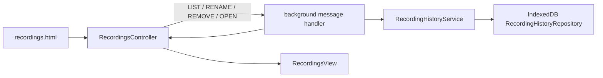

# Recordings — durable recording history

> The standalone recordings page: a small client over the background-owned history service. It lists completed and in-progress local/Drive artifacts, lets the user rename or hide an entry, and opens a confirmed local download or a Drive file. It never owns recording bytes or upload state. For symbol-level structure use codegraph (`codegraph_explore "RecordingsController RecordingHistoryService RecordingHistoryRepository"`).

> **Archetype:** *Interactive Surface*. The page is deliberately thin: durable history belongs to IndexedDB in the background, while this module renders a cursor-paged projection and reconciles each action with the response.

## Purpose and user contract

Open **Recordings** from the popup to see recordings in newest-first order. An entry can contain tab, microphone, and self-video files. Each file is shown as one of:

- an available local download, which opens in Chrome's Downloads UI;
- an available Drive file, which opens its Drive link;
- a pending save/upload;
- an unavailable file, with the recovery or download error that explains why it cannot be opened.

Renaming changes only the history label. **Delete history** is a soft delete: it hides the entry from this page but never deletes a local download or a Drive file. The tombstone also prevents delayed upload, download-settlement, or recovery messages from recreating an entry the user removed.

## Data flow

The background creates a pending history record before local download or detached Drive work starts. It then advances that same record as download settlement, Drive-upload updates, crash recovery, or local fallback outcomes arrive. `RecordingHistoryService` owns those transitions; the page never tries to infer a file's availability from an upload tab.

## Pagination and reconciliation

History uses a stable `(createdAt, id)` cursor and a bounded page size (50 by default, at most 100). The repository's IndexedDB v3 `activeCreatedAtId` index contains only visible entries, so retained soft-delete tombstones cannot make **Load more** scan every deleted record. `loadMore()` appends only entries not already present, so a repeated response cannot duplicate a card.

Rename and delete update the rendered list from their command responses rather than reloading the first page. This preserves entries already loaded through **Load more** and avoids a stale first-page refresh overwriting the user's local page state.

## Files

| File | Role |
| :--- | :--- |
| `../recordings.ts` | page entrypoint: finds the static elements, creates the view and controller |
| `RecordingsController.ts` | cursor state, RPC calls, response reconciliation, and action error handling |
| `RecordingsView.ts` | DOM-only rendering and interaction callbacks |

The durable domain types and message guard are [`shared/recordingHistory.ts`](../shared/recordingHistory.ts). The repository and transition service are documented in [`background`](../background/README.md).

## Testing notes

`__tests__/` covers controller paging, deduplication, rename/remove reconciliation, and local-file actions with mocked background messages. The history service/repository tests live beside the background implementation because atomic mutation and IndexedDB ordering are persistence contracts, not page behavior. `tests/e2e/recording-history.spec.ts` validates a real v2→v3 IndexedDB migration and active-only paging index in the built extension.

## Related

- [`popup`](../popup/README.md) — popup navigation and detached upload tabs.
- [`background`](../background/README.md) — the history service and lifecycle integrations.
- [`shared`](../shared/README.md) — history types, cursors, normalization, and message validation.
