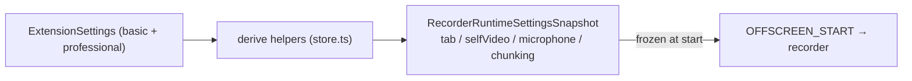

# Settings — the recorder configuration schema & derive pipeline

> A **deep module** under `shared/`: it owns the user-facing extension settings, their persistence and normalization, and the *derivation* of the concrete numbers the recorder consumes. Callers import only from `index.ts` — `model.ts` / `store.ts` / `normalize.ts` / `defaults.ts` are internal. For symbol-level structure use codegraph (`codegraph_explore "ExtensionSettings buildRecorderRuntimeSettingsSnapshot"`).

> **Archetype:** *Reference Catalog*. The valuable thing here is an accurate, complete **reference** — the full settings matrix and exactly how each field becomes a recorder parameter. So this README leads with the schema tables and the derive pipeline rather than prose. If you read one section, read **The settings schema**.

## Purpose & mental model

The single source of *configuration* — with one deliberate exception: the Google OAuth grant behind Drive uploads is **not** part of `ExtensionSettings`. It is a credential, not a preference, and lives under its own storage key behind [`platform/capabilities`](../../platform/capabilities/README.md).

The single source of *configuration*. Two responsibilities: (1) hold the user's choices (`ExtensionSettings`, persisted in `chrome.storage.local`), and (2) **derive recording choices** into the exact numeric `RecorderRuntimeSettingsSnapshot` the offscreen recorder needs. The mental model: **the Settings page edits the schema — autosaving every change, and mirroring back changes the popup writes; the background freezes recorder settings at `start()` and ships them in `OFFSCREEN_START`**—so encode/capture choices are fixed for the run. The privacy preference is intentionally different: every runtime watches it live so opt-out stops collection immediately rather than waiting for the next recording.

## The settings schema

`ExtensionSettings` (`model.ts`) splits into **privacy**, **basic** recording controls, and **professional** encode tuning:

### privacy

| Field | Type | Drives |
| :--- | :--- | :--- |
| `anonymousDiagnostics` | `boolean` (default `true`) | production telemetry collection, checkpoint/outbox retention, sampling, and delivery; `false` immediately broadcasts disablement, resets reducers, deletes telemetry IndexedDB data, and cancels retry alarms |

### basic

`recordingMode`, `microphoneRecordingMode`, `separateCameraCapture` and
`professional.tabContentType` are also the popup's pre-start form, which writes a
choice made there straight back here through `saveRunConfigAsDefaults` (the
inverse of `buildDefaultRunConfigFromSettings`) — so a setup entered once in the
popup is the next run's default instead of something to re-enter on every open.

| Field | Type | Drives |
| :--- | :--- | :--- |
| `recordingMode` | `'opfs' \| 'drive'` | `RunConfig.storageMode` (`opfs`→`local`) |
| `microphoneRecordingMode` | `'off' \| 'mixed' \| 'separate'` | `RunConfig.micMode` |
| `separateCameraCapture` | `boolean` | `RunConfig.recordSelfVideo` |
| `selfVideoResolutionPreset` | `640x360 \| 854x480 \| 1280x720 \| 1920x1080` | camera `getUserMedia` target dimensions |
| `selfVideoUseAutoResolution` | `boolean` | record the browser-delivered resolution, **skip the resize re-rasterization** |
| `tabRecordingFormat` | `'webm' \| 'mp4'` | container for the tab artifact; WebM is the default |
| `cameraRecordingFormat` | `'webm' \| 'mp4'` | container for the separate self-video artifact; WebM is the default |
| `microphoneRecordingFormat` | `'webm' \| 'm4a'` | container for a **separate** microphone artifact; WebM is the default |

### professional

| Field | Drives |
| :--- | :--- |
| `selfVideoFrameRate` | camera capture fps (**default 24** — a talking head is low-motion, so 24 cuts encode work and bytes vs. 30 with no perceptible loss). The camera bitrate has **no** user knob — fully automatic: delivered `W×H×fps × SELF_VIDEO_QUALITY_FACTOR` (0.05), clamped within the `SELF_VIDEO_MIN_ADAPTIVE_BITS_PER_SECOND` floor / `SELF_VIDEO_DEFAULT_BITS_PER_SECOND` ceiling, mirroring the tab. |
| `tabResolutionPreset`, `tabMaxFrameRate` | tab capture target dimensions + fps ceiling |
| `tabContentType` | `'screen' \| 'video'` — the **only** tab-bitrate knob. Selects the quality factor (screen ≈ low bits/pixel for UI/code/slides; video ≈ high bits/pixel for motion). The ceiling is the internal `MAX_TAB_VIDEO_BITRATE`, not user-facing. It reaches a run as `RunConfig.tabContentType`, chosen in the popup's pre-start form — which **remembers** the choice by writing it back here, so it is the next run's default too. |
| `microphoneEchoCancellation`, `microphoneNoiseSuppression`, `microphoneAutoGainControl` | mic `getUserMedia` constraints (DSP) |
| `chunkDefaultTimesliceMs`, `chunkExtendedTimesliceMs` | `MediaRecorder` timeslice selection |

(That every one of these reaches the recorder is verified end-to-end by the real-hardware *settings matrix* check, not just by unit tests.)

## The derive pipeline

The derive helpers turn *choices* into *numbers*:

- **`resolveTabVideoBitrate`** computes `width × height × fps × qualityFactor`, clamped to `[TAB_MIN_VIDEO_BITRATE, MAX_TAB_VIDEO_BITRATE]`. The factor comes from `tabContentType` (`TAB_SCREEN_QUALITY_FACTOR` ≈ 1.5 Mbps@1080p30 vs. `TAB_VIDEO_QUALITY_FACTOR` ≈ 5 Mbps@1080p30); the ceiling is the internal `MAX_TAB_VIDEO_BITRATE` (there is no user-facing bitrate knob, so it can never be set stale). **Crucially, `getTabOutputSettings` doesn't pre-compute the bitrate** — it ships the dimensions and content type in the snapshot, and the offscreen (`TabRecorderTask`) runs the formula against the *delivered* track dimensions from `getSettings()`, not the requested preset. So the bitrate matches what Chrome actually captured (which may be smaller for a windowed/HiDPI tab), instead of over-provisioning for the requested size.
- **`getSelfVideoProfileSettings`** maps the preset to dimensions + carries the adaptive bitrate floor/ceiling, `autoResolution`, and the camera format.
- **`getTabOutputSettings`** / **`getMicrophoneCaptureSettings`** carry the selected tab and separate-microphone formats alongside their capture settings; the mixed microphone path uses the tab format because it is encoded into the tab artifact.
- **`getChunkingSettings`** passes the timeslice timings through.
- **`buildRecorderRuntimeSettingsSnapshot`** assembles all of the above into the one frozen object the background sends down. `buildDefaultRunConfigFromSettings` derives the popup's default `RunConfig`.

## UI feedback for camera profile choices

The redesigned Settings page still edits this same schema; it does not introduce a second set of recorder preferences. The popup's setup form reads the derived self-video profile and, when separate camera capture is selected with a sub-1080p preset, shows a non-blocking nudge to raise the setting. That nudge describes the configured target profile for the next run. The recorder still reports the **actual** tab/camera constraints it receives at runtime, so it must not be treated as a guarantee of device output.

## Persistence & the deep-module boundary

- **`store.ts`** keeps an in-memory `runtimeSettings` cache and `load`/`save`/`reset` against `chrome.storage.local` (key `EXTENSION_SETTINGS_STORAGE_KEY`). When the storage area is absent (e.g. the e2e tab-capture runtime), it **degrades to defaults** rather than throwing.
- **`normalize.ts`** is the trust boundary: `normalizeExtensionSettings` coerces any persisted/incoming value into a valid, fully-populated `ExtensionSettings` (every field defaulted), so downstream derive code never sees a partial object.
- **Legacy migration is built in.** `normalizeLegacyVideoFormat` upgrades the *old numeric* self-video size (`1080 | 720 | 480 | 360`, used before preset selectors existed) into a `ResolutionPreset`, so settings persisted by an older version load losslessly — no migration script. Missing or invalid recording-format fields normalize to their WebM defaults, preserving existing installations. Validation is **bounded**: `normalizePositiveInt` clamps numeric fields to a `[min, max]`, and unknown enum values coerce to the default.
- **Diagnostics migration is default-on but preserves an explicit opt-out.** A legacy settings object with no `privacy` block receives `anonymousDiagnostics: true`; once stored as `false`, normalization/cloning keeps it false.
- **The public surface is `index.ts`.** Nothing outside this folder should import `model`/`store`/`normalize`/`defaults` directly.

## Key invariants & gotchas

- **Import from the module index, not internal files** — that boundary is what lets the internals evolve.
- **Normalize on every read.** Persisted settings are untrusted (old versions, manual edits); `normalizeExtensionSettings` is the only safe entry.
- **Tab bitrate is derived, not stored.** There is no stored tab bitrate at all — only `tabContentType`. The effective bitrate is `w × h × fps × factor` computed in the offscreen against the resolution Chrome actually delivered, capped at the internal `MAX_TAB_VIDEO_BITRATE`.
- **A run's settings are frozen at `start()`.** Editing settings mid-recording affects only the *next* run; the active run uses its snapshot.
- **Privacy is live, not frozen.** Turning anonymous diagnostics off during a run must stop sampling/collection and delete pending evidence immediately; it must never stop or alter capture, saving, fallback, or upload.
- **Format capability is checked twice.** The Settings page uses `MediaRecorder.isTypeSupported()` to disable unavailable MP4/M4A choices, and startup revalidates the frozen profile before it opens streams. An unsupported persisted choice fails with an instruction to change Settings; it never silently falls back to WebM.
- **Mixed microphone audio follows the tab format.** `microphoneRecordingFormat` is consulted only when `micMode === 'separate'`; disabled, mixed, and unrequested streams do not block startup on their own format capability.
- **`selfVideoUseAutoResolution` short-circuits the resize.** It's the lever that trades enforced dimensions for skipping the per-frame re-rasterization.

## Files

| File | Role |
| :--- | :--- |
| `index.ts` | the public interface (the only import surface) |
| `model.ts` | `ExtensionSettings` + the derived `*Settings` / `RecorderRuntimeSettingsSnapshot` types |
| `defaults.ts` | `DEFAULT_EXTENSION_SETTINGS`, storage key, bitrate quality-factor/clamp constants |
| `normalize.ts` | `normalizeExtensionSettings`, preset→dimensions, clone/normalize the recorder snapshot |
| `store.ts` | in-memory cache, load/save/reset, all the derive helpers |
| `validate.ts` | bounded validators (`normalizePositiveInt` min/max clamps, `readBoundedPositiveInt`) used by normalize |
| `../recordingFormats.ts` | shared container/MIME capability policy used by the Settings page and offscreen recorder tasks |

Consumers: the **Settings page** (`../../settings.ts`) edits the schema; the **popup** derives its default `RunConfig`; the **background** freezes `buildRecorderRuntimeSettingsSnapshot` into `OFFSCREEN_START`; the **offscreen** recorder (`RecorderProfiles`, capture) consumes the snapshot.

## Testing notes

- `__tests__/extensionSettings.test.ts` and `settings.test.ts` cover normalization (including default-on diagnostics and preserved opt-out), UI persistence, format migration/cloning/snapshot propagation, the derive math (`resolveTabVideoBitrate` factor + clamp, `tabContentType` selection), and run-config derivation. Telemetry store/runtime tests cover destructive opt-out propagation; the delivered-dimension bitrate path is exercised in `offscreen/__tests__/RecorderEngine.test.ts`.
- Normalization and derivation are pure given a settings object — test with values, no storage mock needed (the storage seam is `hasLocalStorageArea`/`get`/`set`, mocked separately).

## Related

- [`offscreen`](../../offscreen/README.md) — `RecorderProfiles` and capture consume the frozen snapshot (MIME/bitrate/timeslice policy).
- [`background`](../../background/README.md) — freezes the snapshot at `start()` and sends it in `OFFSCREEN_START`.
- [Perf roadmap](../../../docs/plans/perf-optimization-roadmap.md) — `PerfFlags` are a **separate** runtime-flag system from these user settings; don't conflate them.

## External references

- MDN — [`MediaTrackConstraints`](https://developer.mozilla.org/en-US/docs/Web/API/MediaTrackConstraints) (the resolution/frameRate/DSP constraints these fields populate) and [`MediaRecorder` options](https://developer.mozilla.org/en-US/docs/Web/API/MediaRecorder/MediaRecorder#options) (`videoBitsPerSecond`, `timeslice`).
- Chrome — [`chrome.storage.local`](https://developer.chrome.com/docs/extensions/reference/api/storage) (where settings persist across restarts).
